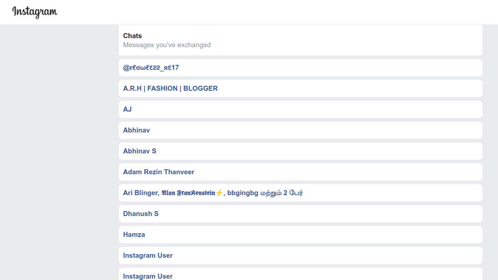

<h1>Catfishing</h1>

Duping or Catfishing is the point at which somebody utilizes pictures and data (frequently taken from others social media accounts) to make another character on the social media - at times involving a singular's whole way of life as their own (Personation) Recently made social media accounts can then be utilized to harm the standing of the genuine proprietor of the personality, or on the other hand any imaginary characters that are made utilizing others pictures and data can be utilized to frame unscrupulous (dishonest relations) connections on the media. Despite the fact that duping or Catfishing used to be seen more among grown-ups utilizing web-based dating platforms, it has now turned into a more inescapable issue among grown-ups and youngsters. Some people who catfish take drastic actions to make counterfeit characters - having various social media accounts determined to develop and approving their duping or catfishing profiles.

<h4>  ·  <a href="https://github.com/Rj979/icecoldbixch/blob/master/README.md"> Documentation </a>  ·  <a href="https://github.com/Rj979/icecoldbixch/issues"> Report Bug </a>  ·  <a href="https://github.com/Rj979/icecoldbixch/issues"> Request Feature </a> </h4>

# :notebook_with_decorative_cover: Table of Contents

- [About the Project](#star2-about-the-project)

## :star2: About the Project

### :art: Color Reference
| Color | Hex |
| --------------- | ---------------------------------------------------------------- |
| Primary Color |  #a92474 |
| Secondary Color |  #393E46 |
| Accent Color |  #00ADB5 |
| Text Color |  #EEEEEE |
